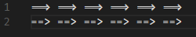
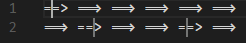

### Disable Ligatures

A simple extension to disable ligatures for selected lines or cursor position

### Settings:  
`"disableLigatures.mode": "Line"`  
Disable all ligatures on the current line  

`"disableLigatures.mode": "Cursor"`  
Disable ligatures at cursor position  

`"disableLigatures.ligatures"`  
Choose which ligatures to disable